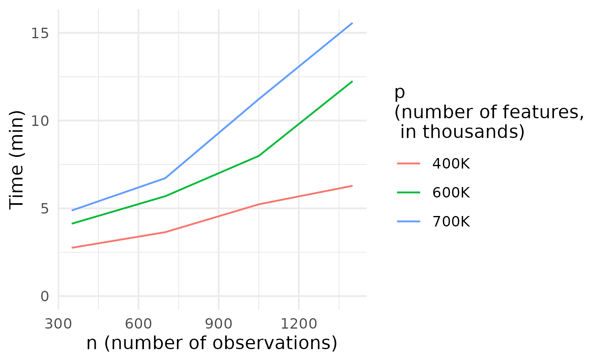

# Purpose

The purpose of this repository is to create an extended demonstration of the [`plmmr`](https://github.com/pbreheny/plmmr) package. The focus here is assessing the performance of `plmmr` for real data sets larger than those that ship with the package.

This demonstration uses data from the [PennCATH study](https://pubmed.ncbi.nlm.nih.gov/21239051/) of genetic risk factors for coronary artery disease. You may download the publicly-available data from one of the following sources (the contents are the same):

-   [Data (zip)](https://d1ypx1ckp5bo16.cloudfront.net/penncath/penncath.zip): for Windows users

-   [Data (tar)](https://d1ypx1ckp5bo16.cloudfront.net/penncath/penncath.tar.gz): for Mac/Linux users

Once downloaded, you will need to unzip/untar the data into the folder of your choice. Throughout the tutorial, I will assume that the unzipped data files are in a folder called 'data'; if you store them somewhere else, you will need to change the directory references.

# Summary

This repository holds work related to four distinct objectives, all of which are related to **demo**nstrating **plmmr** package performance.

1.  Objective 1: Examine how **plmmr** scales with respect to computational time. We examine this using the PennCath data.
2.  Objective 2: Compare the predictive performance of a **plmmr** model with that of a **glmnet** model. We do this with two datasets: the 'PennCath' data and the 'bladder' data.
3.  Objective 3: Compare the performance of **plmmr** to two other packages: **ggmix** (R) and **PenalizedGLMM** (Julia). We do this with both the PennCath data and the 'bladder' data.

## Objective 1 - Computational time details

Here are the results for the computational time needed to fit a penalized linear mixed model with `plmmr`; $n$ is the number of observations (e.g., samples) and $p$ is the number of features (e.g., variants). All computations were run on a laptop using a single core.

# Structure

This demonstration is structured in the following way:

-   the 'scripts' folder contains the code used to analyze the data/fit the models. Subfolders are sorted according to each of the research objectives.

-   the 'R' folder has the R functions to run the analysis and synthesize results.

To run these scripts on your computer, **you will need to create two folders, called 'data' and 'results'**. The 'data' folder has all the PLINK data files (.bed/.bim/.fam) as well as the .csv file of meta-data. The 'results' folder has the .rds/.bk files with the objects returned by our model fitting process.

By making this repository public, my goal is to ensures the reproducibility and transparency of my work. The publicly available data & scripts allow users/readers to follow along with this demonstration and compare their results with the ones shown in my graphs. I welcome user feedback (via pull requests and/or issues).

# Scripts

The order and purpose of each script within each objective:

## Objective 1: Scaling

-   `qc.sh` documents what I did to clean the data, using [PLINK 1.9](https://www.cog-genomics.org/plink/1.9/) and R 4.4.1.

-   `create_subsets.sh` documents how I created the subsets of data of varying numbers of features (i.e., SNPs) and observations (i.e., samples)

-   `setup_results_folders.R` creates subfolders under `results/` that will contain the results of the analysis for objective 1. A subfolder is created for each of the 12 data (sub)sets used to assess computational time.

-   `save_timestamps.R` creates an RDS object that stores the run times for each model fit

-   `run_all_analyses.R` fits models for all combinations of $n$ and $p$. Results are saved to the RDS object in the 'results' subfolder.

-   `get_eigen_times.R` and `get_plmm_fit_time.R` both extract time stamps from the log files of each model fit. The goal here was to break down how much time is spent in the eigendecomposition step as compared to how much time is spend in the actual model fitting.

-   `fig.R` has the code I used for creating figures

## Objective 2: Gene expression analysis

-   `bladder-process.R` preprocesses the **bladder** data.

-   `bladder-analysis.R` fits models and implements the comparisons

## Objective 3: Comparing mixed model methods

-   `penncath-setup.R` has the preparatory steps for the comparison

-   `penncath-plmmr.R` fits the penalized linear mixed models with **plmmr**

-   `penncath-ggmix.R` fits the mixed models with **ggmix**

-   `PenalizedGLMM-ManuscriptRun.ipynb` documents the model fitting done with Julia package **PenalizedGLMM**

## Objective 4: Comparing glmnet and plmmr

-   `setup.R` creates a data matrix that includes both covariates 'sex' and 'age' along with the SNP data from the PennCath study, **without standardizing this data matrix**.
-   `analysis.R` fits a set of candidate models with each approach (lasso via **glmnet** and penalized linear mixed model via **plmmr**). Final models are chosen with cross-validation, and prediction performance between final models is compared.

# Caveats

This demonstration is run to illustrate the accessibility and performance of **plmmr** on a laptop; I ran these results on a single thread using my 2025 MacBook Pro. Performance of **plmmr** can be dramatically faster if one uses [OpenBLAS](http://www.openmathlib.org/OpenBLAS/) instead of the default BLAS. We encourage users to examine this avenue as a possible speedup.

# References

-   For tutorial-style explanations of how to use plmmr, check out the [documentation website](https://pbreheny.github.io/plmmr/articles/getting-started.html#data-input-types). There are several data sets that 'ship' with the package, and the documentation website has a vignette that covers each of these data sets.

-   For more hands-on experience with GWAS data, check out [this other tutorial](https://pbreheny.github.io/adv-gwas-tutorial/index.html).

-   For details on the notation I use (e.g., in the comments within scripts), see this [note on notation](https://pbreheny.github.io/plmmr/articles/notation.html).
